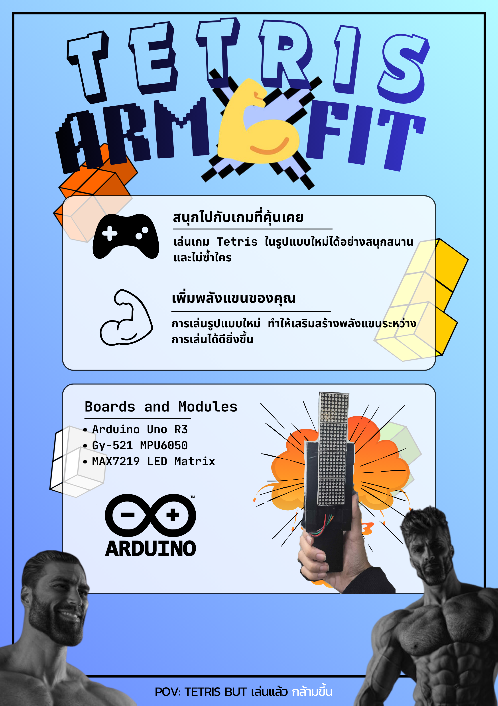

# Tetris ArmFit

Tetis Armfit เป็นโปรเจกต์ของวิชา Physical Computing
Tetris ที่ไม่ได้เล่นด้วย joystick แต่ด้วยข้อมือและแขนของคุณ

### Website

https://varasukmu.github.io/Tetris-armFit.github.io/

## รายชื่อสมาขิก
- 67070114 นายพิชญ บาศรี
- 67070122 นายพีรวิชญ์ นันท์จันทึก
- 67070144 นางสาวเมษ์วดี สีดา
- 67070159 นางสาววารภรณ์ สุขม่วง
